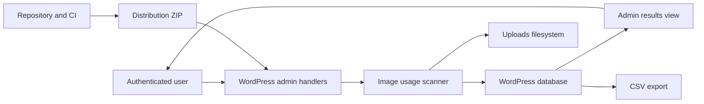

# Threat model: Image Usage Audit

## Executive summary

The highest-risk surfaces are the privileged, synchronous scanner and its exported snapshot. At the audited state, any account with `upload_files` (normally authors, editors, administrators, and multisite super administrators) can enumerate image references across private content, metadata, option names, and upload paths. The scanner is non-destructive and has strong nonce/output-escaping controls, but its broad read scope, unbounded work, spreadsheet export, and absence of a concurrency lock create confidentiality and availability risks.

## Scope and assumptions

- In scope: all tracked runtime, test, documentation, CI, dependency-lock, translation, and distribution files at commit `54e640aaeb0ded2999273cd08ba16c8a70e3260c` on `main`.
- Deployment assumption: a conventional single-site or multisite WordPress 5.9+ installation on PHP 7.4+, with the plugin activated by a trusted administrator.
- Exposure assumption: no anonymous endpoint exists; WordPress authentication, cookies, TLS, and core role/capability mapping are supplied by the host site.
- Data assumption: content, metadata, option values, media paths, and CSV exports may reveal confidential editorial or operational structure even though the plugin does not transmit them.
- Scale assumption: sites may contain thousands of attachments/posts and large option tables; the current scan runs synchronously in one authenticated AJAX request.
- Safety assumption: users may act on “unused” classifications manually outside this plugin, so a false negative can indirectly contribute to deletion of media even though the plugin itself never deletes media.

Open questions that could change ranking: the intended minimum role for access, maximum supported site size, and whether GitHub private vulnerability reporting will be enabled before publication.

## System model

### Primary components

- WordPress admin bootstrap and handlers: `image-usage-audit.php` / `IUA_Plugin`.
- Scanner: `includes/class-iua-scanner.php` / `IUA_Scanner`.
- Admin output and browser interactions: `views/admin-page.php`, `assets/admin.js`, and `assets/admin.css`.
- WordPress database/options and uploads filesystem.
- Uninstall lifecycle: `uninstall.php`.
- Development/release boundary: Composer/npm locks, GitHub Actions, `wp-env`, tests, POT, and the future ZIP.

### Data flows and trust boundaries

- Browser user -> WordPress admin handlers: GET/POST/AJAX fields and nonces over authenticated HTTP; WordPress authenticates, handlers check capability and nonces, and scalar inputs are sanitized/allow-listed.
- Admin handlers -> scanner: administrator-controlled CDN rules plus plugin settings; currently sanitized as text but not structurally bounded or rejected when malformed.
- Scanner -> WordPress database: read-only post/meta/term/option queries plus writes to plugin-owned options; no user input is interpolated into SQL.
- Scanner -> uploads filesystem: recursive read-only enumeration and metadata/file-existence checks; no media write, move, or delete operation exists.
- Stored snapshot -> admin HTML/JavaScript: attachment IDs, names, paths, and provenance; output is contextually escaped and JavaScript inserts notices with `.text()`.
- Stored snapshot -> CSV consumer: site-derived fields pass through `fputcsv`, but spreadsheet formula interpretation is a separate trust boundary.
- Repository -> GitHub Actions -> ZIP/runtime: third-party actions and locked development dependencies execute in CI; the public package must exclude development, test, CI, and Codex files.

#### Diagram

## Assets and security objectives

| Asset | Why it matters | Security objective (C/I/A) |
| --- | --- | --- |
| Private/draft content references | Provenance can disclose unpublished structure and IDs | C, I |
| WordPress option names/values | May encode operational paths and sensitive configuration | C |
| Media classification snapshot | Incorrect results can drive unsafe manual cleanup decisions | I, A |
| Plugin settings/manual marks | Corruption changes classifications and CDN matching | I |
| Uploads filesystem | User media must never be modified by this plugin | I, A |
| WordPress/PHP worker capacity | Unbounded scans can exhaust memory or request time | A |
| CSV export | Opens in software that may interpret formulas | C, I |
| CI credentials and release ZIP | Supply-chain compromise can alter distributed code | C, I |

## Attacker model

### Capabilities

- Anonymous visitors can reach WordPress generally but no plugin-specific unauthenticated action was found.
- Subscribers/contributors can attempt direct requests but normally lack `upload_files`.
- Authors normally possess `upload_files` and, at baseline, can invoke every plugin action and inspect the global scan snapshot.
- Editors, administrators, and multisite super administrators can invoke scans and supply worst-case but syntactically accepted CDN settings.
- A dependency or GitHub Action maintainer could compromise development/CI execution if mutable references or vulnerable packages are consumed.

### Non-capabilities

- No attacker-controlled file upload, include path, outbound HTTP request, remote code loader, telemetry, REST endpoint, or unauthenticated AJAX action was found.
- Scanner findings alone do not delete or modify media; destructive follow-up occurs outside the plugin.
- Non-administrators cannot directly alter arbitrary WordPress options through the reviewed handlers.

## Entry points and attack surfaces

| Surface | How reached | Trust boundary | Notes | Evidence |
| --- | --- | --- | --- | --- |
| Admin page | Media submenu/direct URL | User -> admin | Baseline capability is `upload_files` | `image-usage-audit.php` / `register_menu`, `render_admin_page` |
| Settings save | `admin-post.php` | User -> settings | Section nonces; CDN values lack strict structure/length bounds | `IUA_Plugin::handle_save_settings` |
| Run scan | `admin-ajax.php` | User -> scanner | Nonce/capability present; synchronous and unlocked | `IUA_Plugin::ajax_run_scan` |
| Manual mark actions | `admin-ajax.php` | User -> option | Shared nonce; attachment validation present; bulk input unbounded | `ajax_*manual_used*`, `filter_attachment_ids` |
| CSV export | `admin-post.php` | Snapshot -> spreadsheet | Nonce/capability and `fputcsv`; no formula neutralization | `IUA_Plugin::export_csv` |
| Options/content/meta/terms | Scanner APIs/query | Database -> scanner | Broad read scope; options query is unbounded | `IUA_Scanner::run`, `scan_options_for_uploads` |
| Upload tree | Recursive iterator | Filesystem -> scanner | Read-only; large trees/permission errors affect availability | `find_upload_images` |
| Uninstall | WordPress uninstall | Plugin -> multisite DB | Plugin options only; blog switch stack is not restored correctly | `uninstall.php` |
| CI and locks | GitHub Actions | Source -> build runner | Mutable action tags and scripts execute with repository token | `.github/workflows/qa.yml`, lockfiles |
| ZIP | Build/release process | Repository -> site | No reproducible package procedure at baseline | repository root |

## Top abuse paths

1. Author authenticates -> obtains localized nonce -> runs global scan -> exports private-content/option provenance -> learns confidential site structure.
2. Administrator saves extremely broad/large CDN rewrites -> scanner repeatedly rewrites large values -> request consumes excessive CPU/memory -> admin scan fails.
3. Two authorized users start scans concurrently -> duplicate full-site work and last-writer-wins snapshot -> capacity loss or inconsistent freshness.
4. Malicious site data begins with a spreadsheet formula marker -> administrator exports and opens CSV -> spreadsheet evaluates the cell.
5. Large posts/meta/options/uploads are enumerated in one request -> PHP limit is reached -> no fresh result is stored and stale classifications remain visible.
6. Unsupported/dynamic image reference is missed -> attachment is labelled unused -> human trusts result and deletes media outside the plugin -> content breaks.
7. Mutable CI action tag is compromised -> workflow executes altered code -> release artifact or development environment is compromised.

## Threat model table

| Threat ID | Threat source | Prerequisites | Threat action | Impact | Impacted assets | Existing controls (evidence) | Gaps | Recommended mitigations | Detection ideas | Likelihood | Impact severity | Priority |
| --- | --- | --- | --- | --- | --- | --- | --- | --- | --- | --- | --- | --- |
| TM-001 | Author account | Valid account with `upload_files` | Run/export a global scan beyond the author’s own content | Confidential editorial/operational metadata disclosure | Content references, option names, paths | Nonces and server-side capability checks in `IUA_Plugin` | Capability is too broad for cross-site audit data | Require `manage_options`; document role scope; test denied roles | Log/observe denied action responses in integration tests | High | Medium | High |
| TM-002 | Site data or content author | Administrator opens exported CSV in a spreadsheet | Place formula-leading text in filename, URL, date, or provenance | Local formula execution/data access in spreadsheet context | CSV consumer | RFC-style quoting by `fputcsv` | CSV quoting does not prevent formula interpretation | Prefix dangerous leading characters after whitespace with an apostrophe; unit test markers | Test exported-cell sanitizer corpus | Medium | High | High |
| TM-003 | Authorized administrator or accidental double click | Ability to start scan | Launch concurrent, unbounded scans | PHP/DB exhaustion and last-writer-wins results | Worker capacity, snapshot | Capability/nonce; provenance cap | No lock, batch limits, or cancellation | Add atomic expiring lock; bound bulk input; batch options; document residual synchronous limits | Return explicit “scan already running”; monitor request duration | Medium | Medium | Medium |
| TM-004 | Authorized administrator | Can save CDN settings | Store malformed, excessive, or broad aliases/rewrites | CPU amplification and false classifications | Availability, snapshot integrity | Text sanitization; `preg_quote` for alias regex | No count/length/host/path validation or explicit rejection | Strict parser, count/length limits, reject invalid rules, show error notice | Unit tests for malformed/long rules | Medium | Medium | Medium |
| TM-005 | Large legitimate site | Thousands of posts/options/files | Exhaust time/memory during one synchronous scan | Stale/partial operational decisions | Availability, snapshot integrity | `no_found_rows`, disabled caches in some queries, provenance cap | Multiple full enumerations, unbounded options query and filesystem walk | Batch simple reads now; retain documented scale limit; avoid unproven heavy architecture | Fixture/performance tests and scan timing | High | Medium | High |
| TM-006 | Heuristic gap | Reference form is unsupported | Image is classified unused despite real usage | Human may delete media outside plugin | Media/content integrity | Warnings in UI/readmes; plugin never deletes media | False negatives cannot be eliminated; snapshot staleness | Keep prominent backup/manual-review warnings; expand regression fixtures | Sample fixtures for builders/drafts/CDN variants | Medium | High | High |
| TM-007 | Supply-chain attacker | Compromise of mutable action/dependency or unsafe install script | Execute code in CI | Alter checks/artifacts or expose token | CI, ZIP integrity | Lockfiles; default token is read-only in observed run | Actions use mutable tags; audit/build checks incomplete | Pin actions by full SHA; declare `contents: read`; run audits and package inspection | Dependabot/lock review and CI audit jobs | Low | High | Medium |
| TM-008 | Malformed filesystem/site state | Unreadable upload directory or multisite uninstall | Trigger iterator error or incorrect switch restoration | Failed scan/uninstall cleanup inconsistency | Availability, plugin options | Directory existence check; plugin-owned deletion list | Iterator exceptions not handled; switch stack not unwound | Catch filesystem iteration errors; use `restore_current_blog`; test where possible | Smoke/multisite lifecycle tests | Medium | Low | Low |

## Criticality calibration

- Critical: unauthenticated remote code execution, arbitrary media deletion, or authentication bypass exposing the whole site. No critical finding was validated.
- High: a common lower-privileged role reads global private provenance; spreadsheet payloads execute on administrator open; false-unused results plausibly lead to destructive manual action.
- Medium: authenticated resource exhaustion, malformed settings corrupting classifications, CI supply-chain weakness, or large-site scan failure without direct media mutation.
- Low: recoverable uninstall/iterator failures, minor metadata/documentation mismatches, or defense-in-depth nonce separation with no privilege bypass.

## Focus paths for security review

| Path | Why it matters | Related Threat IDs |
| --- | --- | --- |
| `image-usage-audit.php` | All authorization, CSRF, settings, locking, option writes, and CSV handling | TM-001, TM-002, TM-003, TM-004 |
| `includes/class-iua-scanner.php` | Broad database/filesystem reads and classification integrity | TM-003, TM-004, TM-005, TM-006, TM-008 |
| `views/admin-page.php` | Sensitive snapshot output and safety messaging | TM-001, TM-006 |
| `assets/admin.js` | AJAX invocation and client-side error handling | TM-003 |
| `uninstall.php` | Multisite context and deletion boundaries | TM-008 |
| `.github/workflows/qa.yml` | Third-party execution, permissions, smoke and package gates | TM-007 |
| `composer.lock` | PHP QA supply chain | TM-007 |
| `package-lock.json` | wp-env/npm supply chain and install scripts | TM-007 |
| `readme.txt` | WordPress.org safety/privacy claims | TM-006 |
| `scripts/build-zip.ps1` | Future distribution allow-list and archive integrity | TM-007 |

## Quality check

- Covered all discovered admin-post, AJAX, rendering, database, filesystem, uninstall, CI, and distribution entry points.
- Represented each runtime and CI trust boundary in at least one threat.
- Kept runtime behavior separate from tests, development dependencies, CI, and packaging.
- Used the roles, multisite requirement, scale risks, and non-destructive constraint supplied in the audit request.
- Recorded the remaining owner/scale/private-reporting assumptions explicitly.
